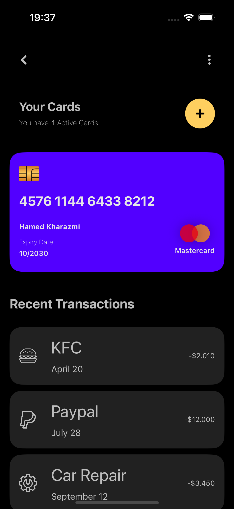
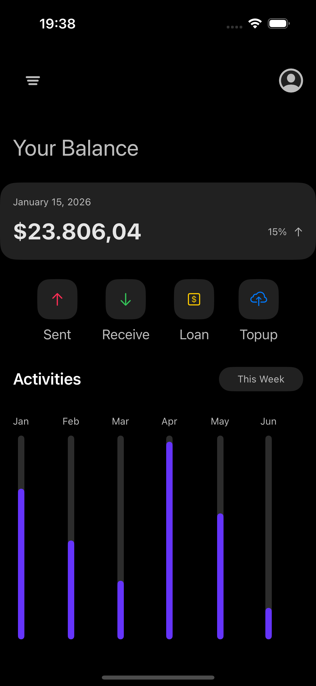
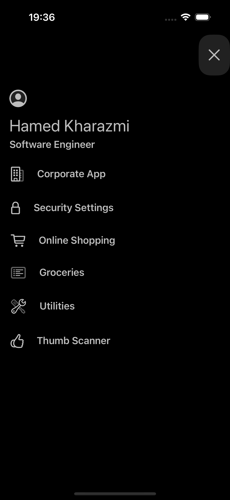

# 💳 Finance App – UI (SwiftUI)

**Finance App – UI** is a **SwiftUI-based user interface project** that demonstrates a modern financial app design.  
This repository focuses **only on the UI layer**, without business logic, backend integration, or real data handling.

---

## Demo
<div align="center">
  <table>
    <tr>
      <td align="center">
        
      </td>
      <td align="center">
        
      </td>
      <td align="center">
        
      </td>
    </tr>
    <tr>
      <td align="center" colspan="3">
        <sub>iPhone</sub>
      </td>
    </tr>
  </table>
</div>

---

The project consists of **three main views**:
- Balance View
- CreditCard View
- About View

This project is ideal as a **UI prototype**, **design showcase**, or a **starting point** for a full-featured finance application.

---

## ✨ Features

- 🎨 Clean and modern financial app UI
- 🧩 Modular and reusable SwiftUI components
- 🧱 Well-structured view hierarchy
- 📐 Consistent spacing, typography, and layout
- ⚡ Lightweight and fast (UI only)

---

## 🧰 Tech Stack

| Category | Technology |
|--------|------------|
| **Language** | Swift |
| **Framework** | SwiftUI |
| **Architecture** | UI-layer only |
| **Platform** | iOS |
| **IDE** | Xcode |
| **Minimum iOS** | iOS 17+ |

---

## 📌 Project Overview

This project is a **UI-only implementation** intended to demonstrate layout, visual hierarchy, and component composition in SwiftUI.

It does **not** include:
- Business logic
- API or backend integration
- Real financial calculations
- Persistent storage

Use cases include:
- UI/UX showcase
- SwiftUI practice project
- Foundation for a real finance app

---

## 📱 Screens

### 1️⃣ Balance View
- Displays account balance information
- Focuses on clear data hierarchy and readability
- Designed to support dynamic data in future implementations

### 2️⃣ CreditCard View
- Shows virtual credit card UI
- Emphasizes card design, layout, and styling
- Ready for animation or interaction extensions

### 3️⃣ About View
- Presents app or user-related information
- Simple and clean informational layout
- Suitable for app details or profile content

---

## 🚀 Getting Started

### 1️⃣ Clone the Repository

```bash
git clone "https://github.com/HamedKharazmi1990/FinanceUIApp"
cd FinanceUI
```

### 2️⃣ Open the Project

    1. Open FinanceUI.xcodeproj in Xcode
    2. Select an iPhone simulator
    3. Choose the screen you want to run and put it in the FinanceUIApp file
    4. Press Run (⌘R)

### 📱 Supported Platforms
| Platform | Support |
|--------|------------|
| **iPhone** | ✅ |
| **iPad** | ✅ |

### 🎨 Design Notes

    Built entirely with SwiftUI

    Uses:
        - Stacks (VStack, HStack, ZStack)
        - Custom reusable components
        - Consistent spacing and typography
    Designed to be easily extended when logic and data layers are added


### 👨‍💻 Maintainer

    Hamed Kharazmi
    📧 hamed.kharazmi@gmail.com
